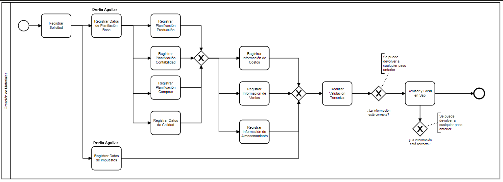

# Materiales

## Mapa del Sitio

1. [Diagrama Flujo](#diagrama-flujo)
2. [Prueba Solicitud](#prueba-solicitud)
3. [Formulario Gestionar Código SAP][(##diagrama-flujo)]

- ## ↗️ Diagramas

### Diagrama Flujo



---

### Prueba Solicitud

```
⚪ Inicio Proceso
      │
      │
5993 Registrar ─┬── 5995 Registrar Datos
Solicitud       │   Planificación Base
                │             │
                │             │
                │             │
                │             │
                │      5996 Registrar Información ────┐
                │      de Costos                      │
                │             │                       │
                │             │                       │
                │      5997 Registrar Información ────┤
                │      de Ventas                      │
                │             │                       ├─── 5999 Realizar      ─── 6000 Revisar y
                │             │                       │    Validación Técnica     Crear en Sap
                │      5998 Registrar Información ────┤                                 │
                │      de Almacenamiento              │                                 │
                │                                     │                                 │
                │                                     │                                 │
                │                                     │                           ⚫Fin Proceso
                │                                     │
                └── 5994 Registrar Datos ─────────────┘
                    de Impuestos
```

---

### Bosquejo


- ## 🎏 Descripción General

### Proceso

Materiales: **8**

---

### Actividades

| Actividad | Detalle                                 | Id sol_plantillas_cliente | Id frm_Formularios | Formulario |
| --------- | --------------------------------------- | ------------------------- | ------------------ | ---------- |
| 80        | Registrar Solicitud                     | 8                         | 80                 | p8_f1      |
| 81        | Registrar Datos Planificación Base      |                           | 81                 | P8_f2      |
| 82        | Registrar Datos de Impuestos            |                           | 82                 | p8_f3      |
| 83        | Registrar Planificación Producción      |                           | 83                 | p8_f4      |
| 84        | Registrar Planificación Contabilidad    |                           | 84                 | p8_f5      |
| 85        | Registrar Planificación Compras         |                           | 85                 | p8_f6      |
| 86        | Registrar Datos de Calidad              |                           | 86                 | p8_f7      |
| 87        | Registrar Información de Costos         |                           | 87                 | p8_f8      |
| 88        | Registrar Información de Ventas         |                           | 88                 | p8_f9      |
| 89        | Registrar Información de Almacenamiento |                           | 89                 | p8_f10     |
| 90        | Realizar Validación Técnica             |                           | 90                 | p8_f11     |
| 91        | Revisar y Crear en SAP                  |                           | 91                 | p8_f12     |
| 92        | Aprobación Vicepresidencia o Sociedad   |                           | 92                 | p8_f17     |


## 📋 Diligenciamiento Formularios

### Formulario Registrar Solicitud

1. Se debe seleccionar el ***Tipo de Material*** para que se cargue la configuración establecida en el parametrizador de campos para este ese material.

2. Se debe seleccionar una ***Vicepresidencia*** para que se filtren las sociedades.

3. Se debe seleccionar al menos una ***sociedad***.

4. Se debe seleccionar una ***Clave*** para que se pueda generar una descripción.

5. Los campos ***Denominación*** y ***Descripción larga*** se cargan de acuerdo a lo registrado al ***Generar la Descripción***.

6. Se debe seleccionar al menos un ***Centro*** y ***Generar los Datos de Centro***.

> :information_source:  **Info**  
> _Con los anteriores pasos ya es posible guardar el formulario._
>

---

### Formulario Registrar Datos Planificación Base

1. Ingresar datos requeridos en Grid ***"gPlantData"***.

2. Marcar una de las opciones del campo ***¿Reasignar solicitud?*** .

> :information_source:  **Info**  
> _Con los anteriores pasos ya es posible guardar el formulario._

---

### Formulario Registrar Datos de Impuestos

1. Marcar una de las opciones del campo ***¿Reasignar solicitud?*** .

> :information_source:  **Info**  
> _Con los anteriores pasos ya es posible guardar el formulario._

---

### Formulario Registrar Información de Costos

1. Ingresar datos requeridos en Grid ***"gPlantData"***.

2. Ingresar datos requeridos en Grid ***"gAccountingData"***.

3. Marcar una de las opciones del campo ***¿Reasignar solicitud?*** .

> :information_source:  **Info**  
> _Con los anteriores pasos ya es posible guardar el formulario._

---

### Formulario Registrar Información de Ventas

1. Marcar una de las opciones del campo ***¿Reasignar solicitud?*** .

> :information_source:  **Info**  
> _Con los anteriores pasos ya es posible guardar el formulario._

---

### Formulario Registrar Información de Costos

1. Ingresar datos requeridos en Grid ***"gPlantData"***.

2. Ingresar datos requeridos en Grid ***"gAccountingData"***.

3. Marcar una de las opciones del campo ***¿Reasignar solicitud?*** .

> :information_source:  **Info**  
> _Con los anteriores pasos ya es posible guardar el formulario._

---

### Formulario Registrar Información de Alamcenamiento

1. Se debe seleccionarl al menos un almacen y ***"Generar Datos de Ubicación de Almacenamiento"***.

2. Marcar una de las opciones del campo ***¿Reasignar solicitud?*** .

> :information_source:  **Info**  
> _Con los anteriores pasos ya es posible guardar el formulario._

---

### Formulario Realizar Validación Técnica

1. Marcar una de las opciones del campo ***Datos correctos*** .

> :information_source:  **Info**  
> _Con los anteriores pasos ya es posible guardar el formulario._

---

### Formulario Gestionar Código SAP

1. Marcar una de las opciones del campo ***Gestionar Datos de material en SAP*** .

> :information_source:  **Info**  
> _Con los anteriores pasos ya es posible guardar el formulario._

---